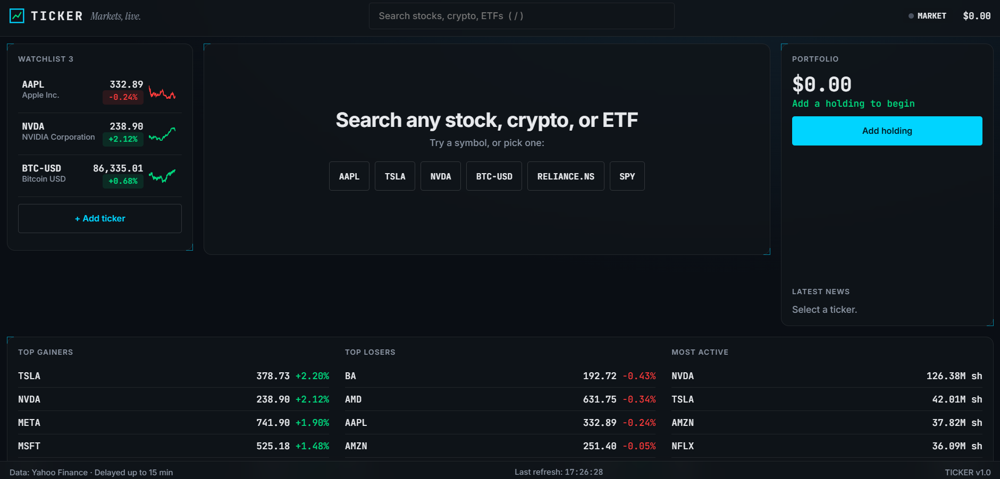

<div align="center">

# 📈 TICKER

### *Markets, live. In your browser.*

A single-page stock, crypto & ETF tracker with a professional trading-terminal aesthetic.

[](https://ticker-jet.vercel.app/)
[](https://github.com/YOURUSERNAME/ticker)



<br/>

**Built with** → `Vanilla JS` · `Chart.js` · `Yahoo Finance API` · `Zero dependencies`

<br/>

[Features](#-features) · [Tech Stack](#-tech-stack) · [Live Demo](https://ticker-jet.vercel.app/) · [Run Locally](#-run-locally) · [Architecture](#-architecture)

</div>

---

## 🌟 What is TICKER?

TICKER is a **stock, crypto, and ETF tracker** built entirely with vanilla JavaScript — no frameworks, no build tools, no API keys.

It looks and feels like a **professional trading terminal** (Bloomberg × Robinhood × Linear), but it's just a single HTML file, a CSS file, and three JS modules.

Search any ticker globally → get live prices → chart it across 8 timeframes → save it to your watchlist → track your portfolio P&L.

All in the browser. All free.

---

## ✨ Features

<table>
<tr>
<td width="50%" valign="top">

### 📊 Market Data
- 🌍 **Global search** — stocks, crypto, ETFs, indices
- 💹 **Live price** + day change %
- 📈 **Line · Candlestick · Area** charts
- ⏱️ **8 timeframes** — 1D · 5D · 1M · 6M · YTD · 1Y · 5Y · MAX
- 🟢 **Market open/closed** detection
- 📉 **Day high/low · 52W range · volume**

</td>
<td width="50%" valign="top">

### ⭐ Watchlist
- 💾 **Saved to localStorage** — persists forever
- 📈 **Inline sparklines** per ticker
- 🎯 **Live price + % change** pills
- ❌ **One-click remove**
- ⚡ **30s auto-refresh**

</td>
</tr>
<tr>
<td width="50%" valign="top">

### 💼 Portfolio Tracker
- ➕ **Add holdings** (symbol, qty, buy price)
- ⚖️ **Weighted-average cost basis**
- 💰 **Live P&L** + % return
- 🍩 **Allocation doughnut** chart
- 🔒 **Persists across sessions**

</td>
<td width="50%" valign="top">

### 🎨 Polish
- ⌨️ **Keyboard shortcuts** (`/` · `←/→` · `Esc`)
- 🔗 **Shareable URLs** (`?symbol=AAPL`)
- 📰 **News headlines** per ticker
- 🔥 **Top Gainers / Losers / Most Active**
- 🍞 **Toast notifications**
- ♿ **Reduced-motion support**

</td>
</tr>
</table>

---

## 🛠️ Tech Stack

<div align="center">

| Layer | Technology |
|:------|:-----------|
| **Markup** |  |
| **Styling** |  |
| **Logic** |  |
| **Charts** |  |
| **Data** |  |
| **Fonts** |  |
| **Deploy** |  |

</div>

**Zero build tools. Zero npm. Zero API keys.**

Just open `index.html` and it works.

---

## 🌍 Supported Markets

<div align="center">

| Market Type | Example Tickers | Suffix |
|:------------|:----------------|:-------|
| 🇺🇸 **US Stocks** | `AAPL` · `TSLA` · `NVDA` | — |
| 🇮🇳 **Indian Stocks (NSE)** | `RELIANCE.NS` · `TCS.NS` | `.NS` |
| 🇮🇳 **Indian Stocks (BSE)** | `RELIANCE.BO` · `TCS.BO` | `.BO` |
| 🪙 **Crypto** | `BTC-USD` · `ETH-USD` · `SOL-USD` | `-USD` |
| 📊 **ETFs** | `SPY` · `QQQ` · `VOO` | — |
| 📉 **Indices** | `^GSPC` · `^NSEI` | `^` prefix |

</div>

---

## 🚀 Run Locally

```bash
# Clone the repo
git clone https://github.com/YOURUSERNAME/ticker.git
cd ticker

# Serve it (any static server works)
python3 -m http.server 8000

# Open in browser
# → http://localhost:8000
```

**Or just double-click `index.html`** — it works without a server.

---

## 📡 API Notes

Yahoo Finance blocks direct browser requests, so TICKER routes calls through a **raced CORS proxy chain** — the first successful response wins.

```javascript
// Two proxies race each other — first success wins
const PROXIES = [
  u => 'https://corsproxy.io/?url=' + encodeURIComponent(u),
  u => 'https://api.allorigins.win/raw?url=' + encodeURIComponent(u),
];
```

<table>
<tr><td><b>⚡ Caching</b></td><td>Quotes → 30s · Search & news → 5 min</td></tr>
<tr><td><b>⚠️ Limitations</b></td><td>No market cap, P/E, beta, or yield from the free endpoint (shown as <code>—</code>)</td></tr>
<tr><td><b>🔧 Production Tip</b></td><td>Swap in a Vercel serverless proxy for stability</td></tr>
</table>

---

## 🏗️ Architecture

```
ticker/
├── 📄 index.html      → Layout + CDN imports
├── 🎨 style.css       → Design system (variables, glass, HUD accents)
├── 🧠 script.js       → UI controller (search, charts, watchlist, portfolio)
├── 🔌 api.js          → Data layer (Yahoo Finance + proxy racing + cache)
├── 💼 portfolio.js    → Portfolio math + localStorage persistence
└── 📖 README.md
```

### 🎯 Design Decisions

<table>
<tr><td><b>🏁 Raced proxies</b></td><td>No single point of failure — resilience by design</td></tr>
<tr><td><b>⚡ Aggressive caching</b></td><td>Avoids rate limits, feels instant</td></tr>
<tr><td><b>🔢 Tabular-nums everywhere</b></td><td>Bloomberg-level number alignment</td></tr>
<tr><td><b>🎨 Green/red only for direction</b></td><td>No color abuse — restrained, professional</td></tr>
<tr><td><b>📊 Auto-refresh only when market open</b></td><td>Saves API calls, doesn't spam proxies</td></tr>
</table>

---

## 🎓 What I Learned

> **Building TICKER taught me more about real-world web dev than any tutorial.**

- 🌐 **CORS in the real world** — public APIs often block browser requests; racing multiple proxies is more resilient than a single fallback
- 📉 **Financial data is messy** — null bars, halted stocks, and split-adjusted prices break naive charts
- ⚖️ **Weighted-average cost matters** — merging multiple lots per symbol requires care (not just averaging prices)
- 🎨 **Professional UI is about restraint** — JetBrains Mono + tabular-nums + green/red-only-for-direction feels more "finance" than any gradient
- ⏰ **Market state matters** — auto-refresh logic depends on session windows, not just a timer

---

## 🚧 Roadmap

- [ ] 📊 Volume bars below charts
- [ ] 🔔 Price alerts with toast notifications
- [ ] ⚖️ Compare overlay (2 tickers on same chart)
- [ ] ☀️ Light theme toggle
- [ ] 📱 Mobile tab switching for panels
- [ ] 🔒 Serverless proxy for stability

---

## 📜 License

**MIT** — free to use, modify, and learn from.

---

## 🙏 Credits

<div align="center">

**Data** → [Yahoo Finance](https://finance.yahoo.com/)
**Charts** → [Chart.js](https://www.chartjs.org/)
**Fonts** → [Google Fonts](https://fonts.google.com/)

Built as **Day 3** of my vibe coding series

</div>

---

## 🔗 Related Projects

<div align="center">

| Project | Description |
|:--------|:------------|
| 🛰️ [**APOGEE**](https://github.com/YOURUSERNAME/apogee) | Live satellite tracker with real-time orbital mechanics |
| 🎁 [**GitHub Wrapped**](https://github.com/YOURUSERNAME/github-wrapped) | Your year in code, visualized |

</div>

---

<div align="center">

### ⭐ If you found TICKER useful, drop a star!

**Built with 🖤 and too much coffee**

</div>
